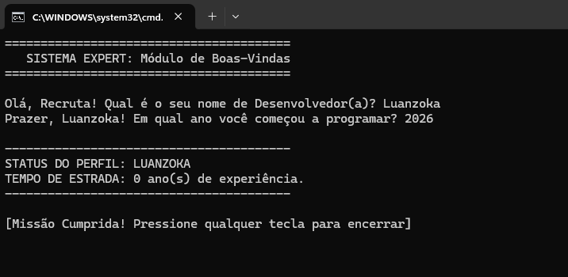

# Projeto Prática C# - Sistema Expert

Este projeto tem como objetivo simular um sistema especialista simples utilizando C#, com base em entrada de dados do usuário e tomada de decisão lógica.

---

## Objetivo

* Praticar conceitos básicos de C#
* Trabalhar com entrada de dados via console
* Aplicar estruturas condicionais
* Simular um sistema especialista baseado em regras
* Executar comandos via terminal utilizando .NET

---

## Funcionamento

O sistema coleta informações do usuário e avalia se ele está apto para executar determinada ação com base em critérios pré-definidos.

### Entrada de dados:

* Nome do usuário
* Nível de experiência

### Processamento:

* Validação dos dados informados
* Aplicação de regras condicionais

### Saída:

* Exibição de mensagens personalizadas
* Indicação de status (apto ou não apto)

---

## Execução do Projeto

Para compilar e executar o projeto via terminal, utilize os seguintes comandos:

```bash
dotnet build
dotnet run
```

### Explicação dos comandos

* `dotnet build`: realiza a compilação do projeto, verificando erros e gerando os arquivos necessários para execução (binários).
* `dotnet run`: executa o projeto após a compilação.

O comando `dotnet build` é importante pois garante que o código está correto antes da execução, permitindo identificar possíveis erros de forma antecipada.

---

## Evidência de Execução

Abaixo está a execução do sistema no terminal:



---

## Observação

O projeto demonstra a aplicação de conceitos iniciais de desenvolvimento em C#, com foco em lógica de programação e interação via terminal.
